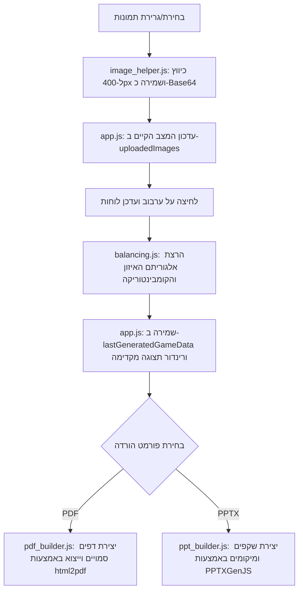

# ארכיטקטורת המערכת - מחולל לוחות בינגו תמונות 🎲

מערכת זו היא אפליקציית אינטרנט חד-דפית (SPA - Single Page Application) הפועלת **בצד הלקוח בלבד (Client-Side Only)** ללא תלות בשרת ייעודי (Serverless). היא מתוכננת לביצועים מרביים, שמירה מלאה על פרטיות המשתמש, וניידות פשוטה (ניתן להריצה מקומית על ידי פתיחת קובץ ה-HTML או לארחה בחינם ב-GitHub Pages).

---

## 📁 מבנה הפרויקט ותפקידי הקבצים

המערכת בנויה בצורה מודולרית ונקייה:

```
├── index.html          # ממשק המשתמש (HTML5), הגדרת פריסה, וטעינת ספריות חיצוניות מ-CDN
├── css/
│   └── style.css       # עיצוב המערכת (Glassmorphism), עימוד רספונסיבי ותמיכה מלאה ב-RTL
└── js/
    ├── app.js          # מנהל המערכת הראשי (Controller): אירועים, מצב המערכת, תצוגה מקדימה ומשוב
    ├── balancing.js    # אלגוריתם חלוקת תמונות מאוזנת וייחודית לכל לוח
    ├── image_helper.js # כלי לעיבוד וכיווץ תמונות (Canvas Scaling) בשמירה על יחס המימדים
    ├── pdf_builder.js  # מנגנון הרכבה וייצוא קובץ PDF (html2pdf.js)
    └── ppt_builder.js  # מנגנון הרכבה וייצוא קובץ PowerPoint (pptxgenjs)
```

---

## 🔄 זרימת הנתונים (Data Flow)

האיור הבא מתאר את זרימת המידע במערכת:



---

## 🧠 אלגוריתם האיזון והמתמטיקה (Balancing & Combinatorics)

מטרת האלגוריתם ב-[balancing.js](file:///c:/Users/Efrat/projects/81_antigravity_tests/2_bingo_generator/js/balancing.js) היא לייצר \(N\) לוחות בינגו ייחודיים בגודל \(K\) תאים (למשל, 9 תאים בלוח 3x3) מתוך מאגר של \(M\) תמונות שהועלו, תוך שמירה על כך שכל תמונה תופיע מספר פעמים שווה ככל הניתן לאורך כל הלוחות.

### 1. חישוב קומבינטוריקה
לפני הייצור, המערכת מחשבת את מספר הלוחות ייחודיים המקסימלי שניתן לייצר ללא חזרתיות (צירופים ללא חשיבות לסדר) באמצעות נוסחת הקומבינטוריקה:
\[C(M, K) = \frac{M!}{K! \cdot (M - K)!}\]

* אם מספר המשתתפים המבוקש \(N \le C(M, K)\), האלגוריתם **יבטיח** שכל הלוחות שייווצרו יהיו ייחודיים לחלוטין (אין שני לוחות עם אותן תמונות בדיוק).
* אם \(N > C(M, K)\), האלגוריתם יאפשר כפילויות של שילובים בלית ברירה, ויציג אזהרה למשתמש.

### 2. שיטת הקיבולת והניקוד (Greedy Capacity & Noise)
כדי להשיג איזון מושלם (שבו כל תמונה מופיעה בדיוק באותו מספר לוחות):
1. **חישוב קיבולת יעד (Target Capacity)**: לכל תמונה מחושב מספר ההופעות האידיאלי שלה:
   \[\text{Target} = \lfloor \frac{N \cdot K}{M} \rfloor\]
   שאריות החלוקה מחולקות באופן אקראי בין התמונות כך שחלקן יקבלו קיבולת של \(\text{Target} + 1\).
2. **בחירת תמונות ללוח**: עבור כל לוח, מחושב ציון עדיפות (Score) לכל תמונה:
   \[\text{Score} = (\text{Target Capacity} - \text{Current Appearances}) + \text{Random Noise}\]
   * רעש אקראי (Random Noise) מתווסף כדי למנוע יצירת לוחות זהים וכדי לגוון את השילובים.
   * התמונות עם הניקוד הגבוה ביותר נבחרות ללוח.
3. **בדיקת ייחודיות**: נבדק האם שילוב התמונות הזה כבר נוצר בלוח קודם (במבנה נתונים מסוג `Set`). אם השילוב כבר קיים, מתבצע ניסיון חוזר (Retry) עם רעש אקראי מוגדל במעט.
4. **מנגנון אתחול (Restart)**: אם האלגוריתם נקלע למבוי סתום (לא מצליח למצוא לוח ייחודי שעומד במגבלות האיזון), הוא מאתחל את התהליך (עד 100 אתחולים) כדי למנוע קריסה או לולאה אינסופית.

---

## 🖼️ עיבוד תמונות יעיל (Image Processing)

שמירת תמונות מקוריות ברזולוציה גבוהה בצד הלקוח (Base64) עלולה להעמיס על זיכרון הדפדפן ולגרום לקריסת תהליך ייצוא ה-PDF או ה-PowerPoint.

הקובץ [image_helper.js](file:///c:/Users/Efrat/projects/81_antigravity_tests/2_bingo_generator/js/image_helper.js) פותר זאת באמצעות:
1. קריאת הקובץ דרך `FileReader`.
2. טעינת התמונה לאלמנט `Image` בזיכרון.
3. שימוש ב-`HTML5 Canvas` כדי שינוי גודל התמונה כך שהצלע הארוכה ביותר שלה תהיה לכל היותר **400 פיקסלים**.
4. השינוי מתבצע תוך שמירה מלאה על יחס המימדים (Aspect Ratio) של התמונה המקורית (ללא חיתוך/מתיחה).
5. ייצוא התמונה המוקטנת כפורמט PNG דחוס בפורמט Base64 Data URL.

---

## 📄 מנגנוני הורדה וייצוא (Export Builders)

המערכת תומכת בשני ערוצי ייצוא מורכבים המתחשבים במספר הלוחות בדף (1, 2, 4 או 6 לוחות לדף A4):

### 1. ייצוא ל-PDF ([pdf_builder.js](file:///c:/Users/Efrat/projects/81_antigravity_tests/2_bingo_generator/js/pdf_builder.js))
* יוצר עץ HTML סמוי בזיכרון (בתוך משתנה) המעוצב בדיוק לפי דרישות הגודל והשוליים של דף A4 (לאורך או לרוחב).
* משתמש בספריית `html2pdf.js` (המבוססת על `html2canvas` ו-`jsPDF`) המצלמת את הדפים הללו וממירה אותם למסמך PDF וקטורי איכותי.
* **פתרון עיוות ומתיחת תמונות (CSS Absolute Centering)**: כיוון ש-`html2canvas` אינה תומכת במאפיין ה-CSS המודרני `object-fit` או בהחלת `max-width` / `max-height` אחוזית בתוך flexbox, עימוד התמונות מבוצע בשיטה קלאסית ויציבה של מיקום מוחלט ומרכוז אוטומטי:
  - התא (`cellEl`) מוגדר כ-`position: relative`.
  - התמונה (`imgEl`) מוגדרת כ-`position: absolute` עם שוליים המייצגים את ריפוד התא (`top/bottom/left/right: cellPadding`), מרכוז מלא (`margin: auto`) ומגבלות גודל גמישות (`max-width: 100%; max-height: 100%; width: auto; height: auto;`).
  - פתרון זה רץ כולו **בזיכרון בלבד** (ללא תלות בהצמדת אלמנטים ל-DOM הראשי או במדידות דינמיות בפיקסלים), ובכך מונע לחלוטין דפים ריקים ב-PDF או מתיחת תמונות.
* **הגבלת אורך כותרת**: כדי למנוע גלישת טקסט או חיתוכו, כותרת המשחק מוגבלת באתר ל-**35 תווים** (על ידי אילוץ HTML של `max-length="35"`). הדבר מבטיח שהכותרת, בתוספת הסיומת המקסימלית `" - לוח 1000"`, תתאים תמיד לשתי שורות ולא תגלוש מחוץ לדף ההדפסה.

### 2. ייצוא ל-PowerPoint ([ppt_builder.js](file:///c:/Users/Efrat/projects/81_antigravity_tests/2_bingo_generator/js/ppt_builder.js))
* עובד ישירות מול ספריית `PPTXGenJS` הפועלת בפורמט וקטורי מונחה עצמים (Objects).
* מתבצע חישוב של קואורדינטות פיזיות באינצ'ים על גבי השקף (מותאם למידות דף A4) למיקום הלוחות והתאים.
* התמונות משולבות בתוך התאים בשיטת "Fit" מתמטית השומרת על פרופורציות התמונה וממרכזת אותה אנכית ואופקית בכל תא בנפרד.
* הלוחות מסודרים מימין לשמאל (RTL) בהתאם לשפה העברית.

---

## 📈 אנליטיקה ומשוב (Analytics & Feedback)

1. **Google Analytics 4 (GA4)**: מוטמע ב-`index.html` ומנטר אירועי שימוש כלליים באתר לשם קבלת סטטיסטיקות על כמות המשתמשים שנכנסו.
2. **משוב (Feedback Form)**: המשתמש מדרג בכוכבים (1-5) ורושם הערות. 
   * אם משתנה ה-`GOOGLE_SCRIPT_URL` ב-[app.js](file:///c:/Users/Efrat/projects/81_antigravity_tests/2_bingo_generator/js/app.js) מוגדר, הנתונים נשלחים באמצעות בקשת `POST` ל-Google Apps Script Web App ומתווספים אוטומטית לגיליון Google Sheets של מנהל האתר.
   * אם המשתנה אינו מוגדר (או בבדיקה מקומית), הנתונים נשמרים ב-`localStorage` של הדפדפן לצורכי בדיקה ופיתוח.
