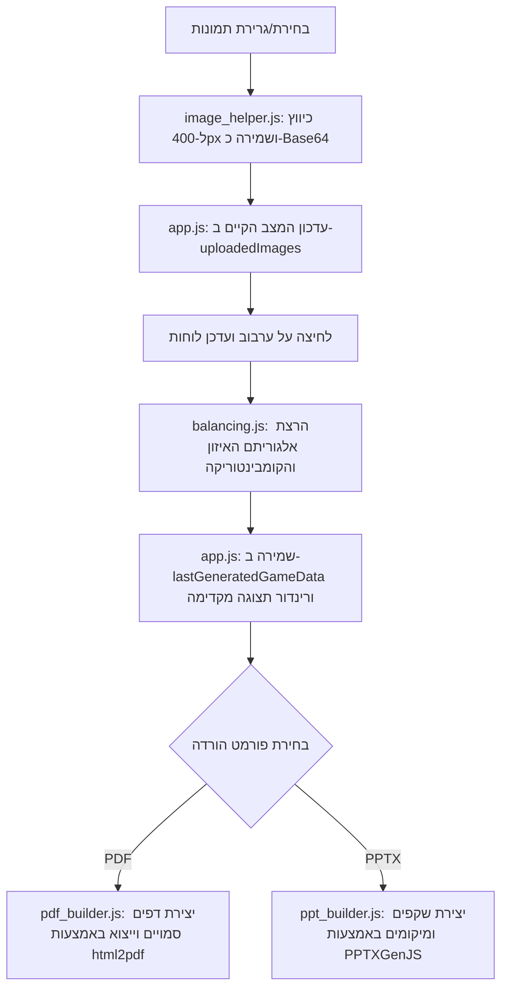
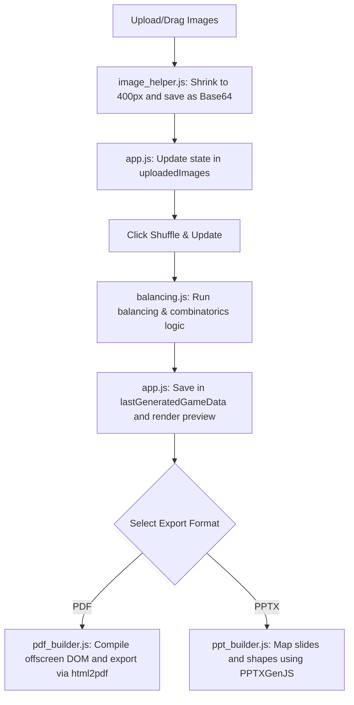

# ארכיטקטורת המערכת - מחולל לוחות בינגו תמונות 🎲

מערכת זו היא אפליקציית אינטרנט חד-דפית (SPA - Single Page Application) הפועלת **בצד הלקוח בלבד (Client-Side Only)** ללא תלות בשרת ייעודי (Serverless). היא מתוכננת לביצועים מרביים, שמירה מלאה על פרטיות המשתמש, וניידות פשוטה (ניתן להריצה מקומית על ידי פתיחת קובץ ה-HTML או לארחה בחינם ב-GitHub Pages).

---

## 📁 מבנה הפרויקט ותפקידי הקבצים

המערכת בנויה בצורה מודולרית ונקייה:

```
├── index.html          # ממשק המשתמש (HTML5), הגדרת פריסה, וטעינת ספריות חיצוניות מ-CDN
├── css/
│   └── style.css       # עיצוב המערכת (Glassmorphism), עימוד רספונסיבי ותמיכה מלאה ב-RTL/LTR
└── js/
    ├── app.js          # מנהל המערכת הראשי (Controller): מילון תרגומים, אירועים, תצוגה מקדימה ומשוב
    ├── balancing.js    # אלגוריתם חלוקת תמונות מאוזנת וייחודית לכל לוח
    ├── image_helper.js # כלי לעיבוד וכיווץ תמונות (Canvas Scaling) בשמירה על יחס המימדים
    ├── pdf_builder.js  # מנגנון הרכבה וייצוא קובץ PDF (html2pdf.js) מבוסס כיווניות שפה
    └── ppt_builder.js  # מנגנון הרכבה וייצוא קובץ PowerPoint (pptxgenjs) מבוסס כיווניות שפה
```

---

## 🔄 זרימת הנתונים (Data Flow)

האיור הבא מתאר את זרימת המידע במערכת:



---

## 🧠 אלגוריתם האיזון והמתמטיקה (Balancing & Combinatorics)

מטרת האלגוריתם ב-[balancing.js](file:///c:/Users/Efrat/projects/81_antigravity_tests/2_bingo_generator/js/balancing.js) היא לייצר \(N\) לוחות בינגו ייחודיים בגודל \(K\) תאים (למשל, 9 תאים בלוח 3x3) מתוך מאגר של \(M\) תמונות שהועלו, תוך שמירה על כך שכל תמונה תופיע מספר פעמים שווה ככל הניתן לאורך כל הלוחות.

### 1. חישוב קומבינטוריקה
לפני הייצור, המערכת מחשבת את מספר הלוחות ייחודיים המקסימלי שניתן לייצר ללא חזרתיות (צירופים ללא חשיבות לסדר) באמצעות נוסחת הקומבינטוריקה:
\[C(M, K) = \frac{M!}{K! \cdot (M - K)!}\]

* אם מספר המשתתפים המבוקש \(N \le C(M, K)\), האלגוריתם **יבטיח** שכל הלוחות שייווצרו יהיו ייחודיים לחלוטין (אין שני לוחות עם אותן תמונות בדיוק).
* אם \(N > C(M, K)\), האלגוריתם יאפשר כפילויות של שילובים בלית ברירה, ויציג אזהרה למשתמש.

### 2. שיטת הקיבולת והניקוד (Greedy Capacity & Noise)
כדי להשיג איזון מושלם (שבו כל תמונה מופיעה בדיוק באותו מספר לוחות):
1. **חישוב קיבולת יעד (Target Capacity)**: לכל תמונה מחושב מספר ההופעות האידיאלי שלה:
   \[\text{Target} = \lfloor \frac{N \cdot K}{M} \rfloor\]
   שאריות החלוקה מחולקות באופן אקראי בין התמונות כך שחלקן יקבלו קיבולת של \(\text{Target} + 1\).
2. **בחירת תמונות ללוח**: עבור כל לוח, מחושב ציון עדיפות (Score) לכל תמונה:
   \[\text{Score} = (\text{Target Capacity} - \text{Current Appearances}) + \text{Random Noise}\]
   * רעש אקראי (Random Noise) מתווסף כדי למנוע יצירת לוחות זהים וכדי לגוון את השילובים.
   * התמונות עם הניקוד הגבוה ביותר נבחרות ללוח.
3. **בדיקת ייחודיות**: נבדק האם שילוב התמונות הזה כבר נוצר בלוח קודם (במבנה נתונים מסוג `Set`). אם השילוב כבר קיים, מתבצע ניסיון חוזר (Retry) עם רעש אקראי מוגדל במעט.
4. **מנגנון אתחול (Restart)**: אם האלגוריתם נקלע למבוי סתום (לא מצליח למצוא לוח ייחודי שעומד במגבלות האיזון), הוא מאתחל את התהליך (עד 100 אתחולים) כדי למנוע קריסה או לולאה אינסופית.

---

## 🖼️ עיבוד תמונות יעיל (Image Processing)

שמירת תמונות מקוריות ברזולוציה גבוהה בצד הלקוח (Base64) עלולה להעמיס על זיכרון הדפדפן ולגרום לקריסת תהליך ייצוא ה-PDF או ה-PowerPoint.

הקובץ [image_helper.js](file:///c:/Users/Efrat/projects/81_antigravity_tests/2_bingo_generator/js/image_helper.js) פותר זאת באמצעות:
1. קריאת הקובץ דרך `FileReader`.
2. טעינת התמונה לאלמנט `Image` בזיכרון.
3. שימוש ב-`HTML5 Canvas` כדי שינוי גודל התמונה כך שהצלע הארוכה ביותר שלה תהיה לכל היותר **400 פיקסלים**.
4. השינוי מתבצע תוך שמירה מלאה על יחס המימדים (Aspect Ratio) של התמונה המקורית (ללא חיתוך/מתיחה).
5. ייצוא התמונה המוקטנת כפורמט PNG דחוס בפורמט Base64 Data URL.

---

## 📄 מנגנוני הורדה וייצוא (Export Builders)

המערכת תומכת בשני ערוצי ייצוא מורכבים המתחשבים במספר הלוחות בדף (1, 2, 4 או 6 לוחות לדף A4):

### 1. ייצוא ל-PDF ([pdf_builder.js](file:///c:/Users/Efrat/projects/81_antigravity_tests/2_bingo_generator/js/pdf_builder.js))
* יוצר עץ HTML סמוי בזיכרון (בתוך משתנה) המעוצב בדיוק לפי דרישות הגודל והשוליים של דף A4 (לאורך או לרוחב).
* משתמש בספריית `html2pdf.js` (המבוססת על `html2canvas` ו-`jsPDF`) המצלמת את הדפים הללו וממירה אותם למסמך PDF וקטורי איכותי.
* **כיווניות**: מזהה את שפת הדף הפעילה. במידה והשפה עברית, הלוחות והתאים מיושרים מימין לשמאל (`dir="rtl"`), ובמידה והשפה אנגלית היישור הוא משמאל לימין (`dir="ltr"`).
* **פתרון עיוות ומתיחת תמונות (CSS Absolute Centering)**: כיוון ש-`html2canvas` אינה תומכת במאפיין ה-CSS המודרני `object-fit` או בהחלת `max-width` / `max-height` אחוזית בתוך flexbox, עימוד התמונות מבוצע בשיטה קלאסית ויציבה של מיקום מוחלט ומרכוז אוטומטי:
  - התא (`cellEl`) מוגדר כ-`position: relative`.
  - התמונה (`imgEl`) מוגדרת כ-`position: absolute` עם שוליים המייצגים את ריפוד התא (`top/bottom/left/right: cellPadding`), מרכוז מלא (`margin: auto`) ומגבלות גודל גמישות (`max-width: 100%; max-height: 100%; width: auto; height: auto;`).
  - פתרון זה רץ כולו **בזיכרון בלבד** (ללא תלות בהצמדת אלמנטים ל-DOM הראשי או במדידות דינמיות בפיקסלים), ובכך מונע לחלוטין דפים ריקים ב-PDF או מתיחת תמונות.
* **הגבלת אורך כותרת**: כדי למנוע גלישת טקסט או חיתוכו, כותרת המשחק מוגבלת באתר ל-**35 תווים** (על ידי אילוץ HTML של `max-length="35"`). הדבר מבטיח שהכותרת, בתוספת הסיומת המקסימלית `" - לוח 1000"`, תתאים תמיד לשתי שורות ולא תגלוש מחוץ לדף ההדפסה.

### 2. ייצוא ל-PowerPoint ([ppt_builder.js](file:///c:/Users/Efrat/projects/81_antigravity_tests/2_bingo_generator/js/ppt_builder.js))
* עובד ישירות מול ספריית `PPTXGenJS` הפועלת בפורמט וקטורי מונחה עצמים (Objects).
* מתבצע חישוב של קואורדינטות פיזיות באינצ'ים על גבי השקף (מותאם למידות דף A4) למיקום הלוחות והתאים.
* התמונות משולבות בתוך התאים בשיטת "Fit" מתמטית השומרת על פרופורציות התמונה וממרכזת אותה אנכית ואופקית בכל תא בנפרד.
* **יישור וכיווניות דינמית**: 
  - בעברית, המערכת קובעת `pptx.rtlMode = true` ומסדרת את הלוחות והתאים בתוכם מימין לשמאל.
  - באנגלית, המערכת קובעת `pptx.rtlMode = false` ומסדרת את הלוחות והתאים בתוכם משמאל לימין.
  - כותרת הלוח מתורגמת דינמית ל-`Board X` או `לוח X` בהתאם לשפה.

---

## 📈 אנליטיקה ומשוב (Analytics & Feedback)

1. **Google Analytics 4 (GA4)**: מוטמע ב-`index.html` ומנטר אירועי שימוש כלליים באתר לשם קבלת סטטיסטיקות על כמות המשתמשים שנכנסו.
2. **משוב (Feedback Form)**: המשתמש מדרג בכוכבים (1-5) ורושם הערות. 
   * אם משתנה ה-`GOOGLE_SCRIPT_URL` ב-[app.js](file:///c:/Users/Efrat/projects/81_antigravity_tests/2_bingo_generator/js/app.js) מוגדר, הנתונים נשלחים באמצעות בקשת `POST` ל-Google Apps Script Web App ומתווספים אוטומטית לגיליון Google Sheets של מנהל האתר.
   * אם המשתנה אינו מוגדר (או בבדיקה מקומית), הנתונים נשמרים ב-`localStorage` של הדפדפן לצורכי בדיקה ופיתוח.

================================================================================

# System Architecture - Custom Picture Bingo Generator 🎲

This system is a client-side Single Page Application (SPA) designed to run **entirely client-side (Serverless)**. It is built for maximum speed, visual quality, total user privacy, and zero server dependencies. You can run it locally by opening the HTML file in any browser or host it for free on platforms like GitHub Pages.

---

## 📁 File Structure & Modules

The codebase is highly modular and organized:

```
├── index.html          # User interface (HTML5), layouts, and external library CDN loaders
├── css/
│   └── style.css       # Core styling (Glassmorphic theme), responsive rules, and RTL/LTR support
└── js/
    ├── app.js          # Controller: manages state, user events, translation dictionary, and feedback
    ├── balancing.js    # Balancing and combinatorics algorithm for board distribution
    ├── image_helper.js # Image processing: downscaling images in-memory via HTML5 Canvas
    ├── pdf_builder.js  # PDF export logic (using html2pdf.js) adapting to current layout direction
    └── ppt_builder.js  # PowerPoint (.pptx) generator (using PPTXGenJS) with directional positioning
```

---

## 🔄 Data Flow

The following diagram illustrates how data flows inside the application:



---

## 🧠 Balancing & Combinatorics Algorithm

The balancing code inside [balancing.js](file:///c:/Users/Efrat/projects/81_antigravity_tests/2_bingo_generator/js/balancing.js) generates \(N\) unique bingo boards containing \(K\) cells from an uploaded pool of \(M\) images. The key goal is to ensure that all images appear an equal number of times across all boards.

### 1. Combinatorics & Uniqueness Analysis
Before shuffling, the application calculates the mathematical combination limit (order-independent subsets):
\[C(M, K) = \frac{M!}{K! \cdot (M - K)!}\]

* If requested participants count \(N \le C(M, K)\), the algorithm **guarantees** that all boards will be unique (no two boards will contain the exact same set of images).
* If \(N > C(M, K)\), some boards will inevitably share the same image sets, and the UI displays a warning message to the user.

### 2. Greedy Capacity & Noise Heuristic
To achieve balance (where each image is placed on the same number of boards):
1. **Target Capacity Calculation**: Calculates the ideal appearance count for each image:
   \[\text{Target} = \lfloor \frac{N \cdot K}{M} \rfloor\]
   Any remainders are randomly distributed among images so some receive a capacity of \(\text{Target} + 1\).
2. **Board Assembly Selection**: For each board slot, every image is given a priority score:
   \[\text{Score} = (\text{Target Capacity} - \text{Current Appearances}) + \text{Random Noise}\]
   * Random noise is added to vary combinations and avoid duplicating layouts.
   * The images with the highest scores are selected for the board.
3. **Uniqueness Verification**: Check if this set of images was already assigned to a previous board (using a hashing `Set`). If it is a duplicate, the iteration retries with a slightly increased noise multiplier.
4. **Stall Avoidance**: If the algorithm runs into a configuration dead-end (e.g. strict capacity limits prevent finding a unique layout), it restarts the process (up to 100 retries) to avoid freezing.

---

## 🖼️ Client-Side Image Processing

Storing high-resolution uploaded images in the browser's memory (as Base64) can crash the browser tab during PDF or PPTX generation.

The helper script [image_helper.js](file:///c:/Users/Efrat/projects/81_antigravity_tests/2_bingo_generator/js/image_helper.js) solves this by:
1. Loading the file via `FileReader`.
2. Rendering the file into an in-memory `Image` object.
3. Utilizing a canvas drawing routine to downscale the image so that its longest side is at most **400 pixels**.
4. Performing the resize while strictly preserving the original aspect ratio (no squeezing or stretching).
5. Compressing and exporting the result as a lightweight PNG base64 Data URL.

---

## 📄 Exporters & Print Layouts (Export Builders)

The exporters handle complex layout density calculations (1, 2, 4, or 6 cards per A4 sheet):

### 1. PDF Exporter ([pdf_builder.js](file:///c:/Users/Efrat/projects/81_antigravity_tests/2_bingo_generator/js/pdf_builder.js))
* Generates a temporary offscreen DOM structure styled in millimeters to match standard A4 specs (portrait or landscape).
* Uses `html2pdf.js` (underpinned by `html2canvas` and `jsPDF`) to snapshot the container and output a vector PDF.
* **Layout Direction**: Inspects `document.documentElement.lang`. If set to Hebrew (`he`), it applies `dir="rtl"` to align columns right-to-left. Otherwise, it defaults to `dir="ltr"`.
* **Aspect Ratio Protection (CSS Absolute Centering)**: Since `html2canvas` struggles with modern CSS layout rules like `object-fit` and percentage boundaries inside nested flex elements, we use a classic absolute centering method:
  - The cell container is set to `position: relative`.
  - The image is set to `position: absolute` with boundaries matching cell padding (`top/bottom/left/right: cellPadding`), full margins (`margin: auto`), and max size bounds (`max-width: 100%; max-height: 100%; width: auto; height: auto;`).
  - This process is fully executed **in-memory** (no attachment to the active visible DOM), preventing layout distortions, cropped images, or empty white pages in the PDF.
* **Title constraints**: The title field is limited to **35 characters** in the UI to ensure that the header and the board index fits cleanly on two lines.

### 2. PowerPoint Exporter ([ppt_builder.js](file:///c:/Users/Efrat/projects/81_antigravity_tests/2_bingo_generator/js/ppt_builder.js))
* Connects directly to the object-oriented API of `PPTXGenJS`.
* Computes coordinates in inches to place cards side-by-side or stacked on slides.
* Automatically fits images in their cells while protecting their aspect ratios.
* **Dynamic Direction Alignment**:
  - In Hebrew, it configures `pptx.rtlMode = true` and loops column indices right-to-left (RTL).
  - In English, it configures `pptx.rtlMode = false` and loops column indices left-to-right (LTR).
  - Translates title labels dynamically (e.g. `Board X` or `לוח X`).

---

## 📈 Analytics & Feedback

1. **Google Analytics 4 (GA4)**: Embedded in `index.html` to log page views and general visitor metrics.
2. **Review submissions**: Users submit a star rating and comment.
   * If `GOOGLE_SCRIPT_URL` is defined in [app.js](file:///c:/Users/Efrat/projects/81_antigravity_tests/2_bingo_generator/js/app.js), the feedback JSON is sent via `POST` to a Google Apps Script Web App which appends a row to a spreadsheet.
   * If the URL is missing, feedback data is written to the browser's `localStorage` for testing.
