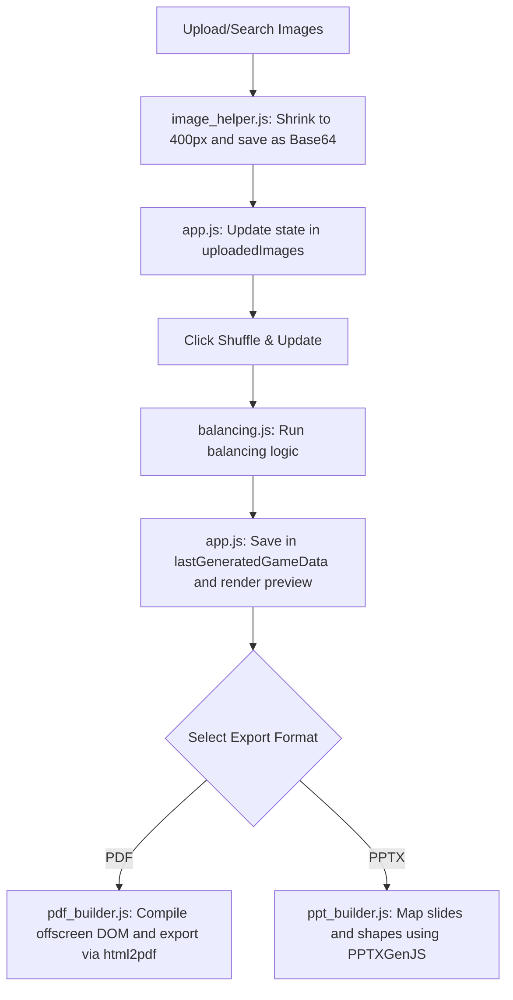

# Custom Picture Bingo Generator 🎲 (Serverless Web App)

An advanced and modern client-side web application (HTML5, CSS3, JavaScript ES6) to create custom, printable picture bingo boards using your own uploaded images or by searching Unsplash.
The application runs **entirely client-side (no server required)**. It can be run locally via Vite or deployed for free on platforms like **GitHub Pages**.
Perfect for kids, classroom vocabulary building, preschool activities, birthday parties, and family game nights (no reading skills required!).

---

## ✨ Key Features

1. **Full Bilingual Support**: The user interface supports a clear toggle between English (LTR) and Hebrew (RTL).
2. **Absolute Privacy (Privacy by Design)**: All image processing, canvas resizing, compression, and shuffling algorithms are executed in-memory on your computer.
3. **Unsplash Integration with Auto-Translate & Spellcheck**: Search Unsplash directly from the UI. Queries in Hebrew are automatically translated to English, and spelling mistakes are autocorrected using Wikipedia's OpenSearch API.
4. **Mathematical Balancing Algorithm**: Distributes images evenly across the boards and computes combinations (\(C(n, k)\)) to analyze uniqueness.
5. **Automatic Image Compression**: Resizes photos in-memory to 400px (via Canvas) while preserving original aspect ratios.
6. **Multi-Format Export**:
   * **PowerPoint (PPTX)** - Editable presentation with vector-positioned cells.
   * **PDF Document** - High-quality, printable sheets.
7. **Custom Print Layouts**: Choose from 1, 2, 4, or 6 boards per A4 page.
8. **Feedback Form Integration**: Submit star ratings and suggestions directly to your cloud Google Sheets spreadsheet.

---

## 🚀 How to Run Locally

Since the project uses Vite to securely manage environment variables (like the Unsplash API key), you must run a local development server:

1. Download the repository files to your computer.
2. Open a terminal in the project directory.
3. Install dependencies:
   ```bash
   npm install
   ```
4. Create a `.env.local` file and add your Unsplash API key:
   ```env
   VITE_UNSPLASH_API_KEY=your_unsplash_access_key_here
   ```
5. Start the development server:
   ```bash
   npm run dev
   ```
6. Open your browser and navigate to the provided localhost URL (usually `http://localhost:5173`).

---

## 🌐 Free Deployment on GitHub Pages

1. Build the project using Vite:
   ```bash
   npm run build
   ```
2. Upload the `dist/` folder to a new **Public** GitHub Repository.
3. Go to the repository **Settings** -> **Pages**.
4. Under **Build and deployment**, select your branch and click **Save**.

---

## 🏗️ System Architecture

This system is a Single Page Application (SPA) designed to run entirely client-side.

### 📁 File Structure & Modules
```
├── index.html          # User interface (HTML5), layouts, and CDN loaders
├── css/
│   └── style.css       # Core styling (Glassmorphic theme) and RTL/LTR support
└── js/
    ├── app.js          # Controller: manages state, Unsplash API, events, and feedback
    ├── balancing.js    # Balancing and combinatorics algorithm
    ├── image_helper.js # Image processing: downscaling images in-memory via Canvas
    ├── pdf_builder.js  # PDF export logic adapting to current layout direction
    └── ppt_builder.js  # PowerPoint (.pptx) generator with directional positioning
```

### 🔄 Data Flow


### 🧠 Balancing Algorithm & Exporters
* **Balancing**: Generates unique boards by checking combination limits (\(C(M, K)\)). If mathematically possible, guarantees uniqueness using a Greedy Capacity & Noise Heuristic algorithm.
* **Exporters**: Support PDF generation (via `html2pdf.js` with offscreen DOM rendering and CSS Absolute Centering for images) and PPTX generation (via `PPTXGenJS` with dynamic RTL/LTR directional alignment).

---

## 📊 Setting Up Feedback Form (Google Sheets)

1. Open a new Google Sheet and set the columns in row 1: `Timestamp`, `Stars`, `Comment`, `GameTitle`, `BoardsCount`.
2. Go to **Extensions** -> **Apps Script** and paste:
   ```javascript
   function doPost(e) {
     try {
       var sheet = SpreadsheetApp.getActiveSpreadsheet().getActiveSheet();
       var data = JSON.parse(e.postData.contents);
       sheet.appendRow([new Date(), data.stars, data.comment, data.title, data.boardsCount]);
       return ContentService.createTextOutput(JSON.stringify({"status": "success"})).setMimeType(ContentService.MimeType.JSON);
     } catch (error) {
       return ContentService.createTextOutput(JSON.stringify({"status": "error", "message": error.toString()})).setMimeType(ContentService.MimeType.JSON);
     }
   }
   ```
3. Click **Deploy** -> **New deployment** -> **Web app**. Set **Execute as: Me** and **Who has access: Anyone**.
4. Copy the Web app URL and paste it in `js/app.js` into the `GOOGLE_SCRIPT_URL` variable.

================================================================================

# מחולל לוחות בינגו תמונות בעיצוב אישי 🎲 (Serverless Web App)

מערכת אינטראנט מתקדמת ומודרנית ליצירת לוחות בינגו מבוססי תמונות בעיצוב אישי. היישום פועל **בצד הלקוח בלבד** ומיועד להפעלה מקומית עם Vite. מיועד במיוחד לפעילויות לילדים, גנים, בתי ספר וימי הולדת (מתאים גם לילדים שטרם למדו לקרוא).

---

## ✨ תכונות עיקריות

1. **תמיכה דו-לשונית מלאה**: מעבר מהיר בין עברית לאנגלית.
2. **פרטיות מוחלטת**: עיבוד התמונות מבוצע במחשב שלך בלבד.
3. **חיפוש תמונות חכם ב-Unsplash**: כולל תרגום אוטומטי מעברית לאנגלית ותיקון שגיאות כתיב בשתי השפות בעזרת ויקיפדיה.
4. **אלגוריתם איזון מתמטי**: חלוקת תמונות מאוזנת וסטטיסטית על גבי הלוחות.
5. **כיווץ תמונות אוטומטי**: שינוי גודל תמונות בזיכרון ל-400px (Canvas) מבלי לפגוע בפרופורציות.
6. **ייצוא לפורמטים מרובים**: PowerPoint (PPTX) ללוחות עריכים, או PDF לאיכות הדפסה גבוהה.
7. **איסוף משוב ל-Google Sheets**.

---

## 🚀 איך להריץ מקומית?

בגלל שהוספנו מנגנון אבטחה לקריאת מפתח ה-API מקובץ סביבה (`.env.local`), המערכת רצה מעתה בעזרת שרת Vite.

1. הורידו את קבצי הפרויקט ופתחו את מסוף הפקודות (Terminal) בתיקייה.
2. התקינו תלויות (חד פעמי):
   ```bash
   npm install
   ```
3. צרו קובץ `.env.local` והכניסו את המפתח שלכם:
   ```env
   VITE_UNSPLASH_API_KEY=your_unsplash_access_key_here
   ```
4. הריצו את השרת:
   ```bash
   npm run dev
   ```
5. פתחו את הדפדפן בכתובת המקומית (לרוב `http://localhost:5173`).

---

## 🏗️ ארכיטקטורת המערכת

מערכת זו היא אפליקציית אינטרנט חד-דפית (SPA) מודולרית:

### 📁 מבנה קבצים
```
├── index.html          # ממשק המשתמש
├── css/
│   └── style.css       # עיצוב ועימוד
└── js/
    ├── app.js          # מנהל המערכת, חיפוש ב-Unsplash ותרגומים
    ├── balancing.js    # אלגוריתם האיזון
    ├── image_helper.js # עיבוד תמונות וכיווץ באמצעות Canvas
    ├── pdf_builder.js  # ייצוא ל-PDF כולל כיווניות (RTL)
    └── ppt_builder.js  # ייצוא ל-PPTX
```

### 🧠 אלגוריתם האיזון
המערכת מייצרת לוחות תוך בדיקת קומבינטוריקה:
אם מספר המשתתפים קטן או שווה ל-\(C(M, K)\), מובטחים לוחות ייחודיים בלבד. אם האלגוריתם נתקל במבוי סתום, הוא משתמש ב-"רעש אקראי" ובמנגנון אתחול עצמי (Restart) עד לפתרון מושלם.

### 🖼️ עיבוד תמונות וייצוא
כדי למנוע קריסות של הדפדפן, תמונות שמגיעות ממחשב המשתמש או מ-Unsplash עוברות כיווץ ב-Canvas עד 400px ונשמרות כ-Base64. בעת הייצוא ל-PDF או PPTX, המערכת מתאימה אקטיבית את כיווניות הדף ל-RTL בעברית ומשתמשת בטכניקות יישור וירטואלי (Absolute Centering) כדי להבטיח איכות מקסימלית ללא עיוות פרופורציות.

---

## 📊 הגדרת טופס המשוב מול Google Sheets

ניתן להעתיק את הסקריפט (Google Apps Script) המופיע בחלק האנגלי, לפתוח פריסת Web App בגוגל שיטס שלכם, ולהעתיק את ה-URL לתוך המשתנה `GOOGLE_SCRIPT_URL` הנמצא בראש הקובץ `js/app.js`.
